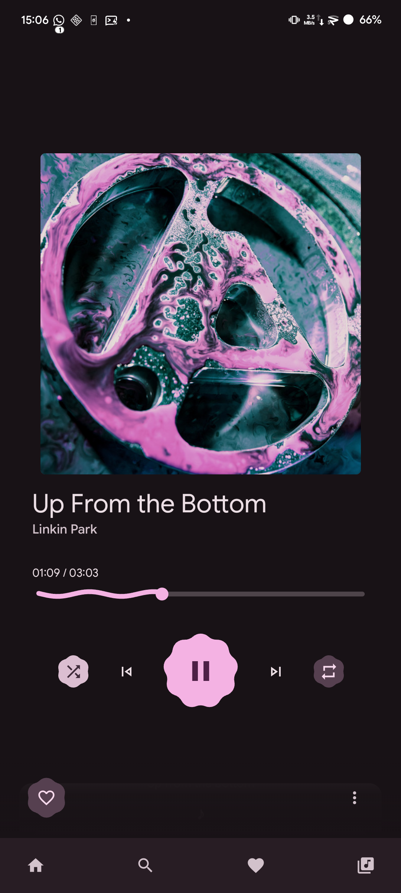
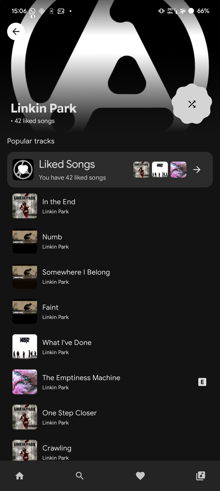
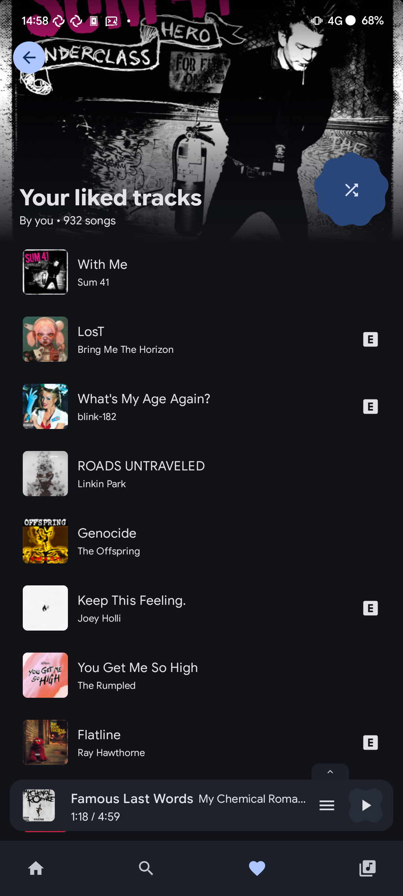

<!-- markdownlint-disable -->

  
  <h1 align="center">
    Outify
  </h1>
  

     
    <strong>
      Implementation of 
      <a href="https://github.com/librespot-org/librespot/">librespot</a>
      for Spotify streaming 
    </strong>
  

  

    <a href="https://github.com/iTomKo/Outify/issues/new?assignees=&labels=bug&projects=&template=bug_report.yml">Report Bug</a>
    ·
    <a href="https://github.com/iTomKo/Outify/issues/new?template=feature_request.md">Request Feature</a>
    ·
    <a href="https://github.com/iTomKo/Outify/discussions/new?category=q-a">Ask Question</a>
  

   

  
  
  

  
  

### Information
Third party open source Android Spotify client with Material 3 using librespot Rust

> [!WARNING]
> Outify is still in early development.
> Any contributions are welcomed.

> [!NOTE]
> Outify works with both free and premium Spotify accounts.
> Free accounts get premium features: ad-free, unlimited skips, on-demand playback, max quality audio.

### Features
Outify is based on librespot backend allowing us to stream Spotify audio.

- 🔓 Free account support with premium features
- 🚫 Ad-free experience (auto-skip + mute)
- ♾️ Unlimited skips & on-demand playback
- 🎵 High quality audio (320kbps)
- 🔍 Searching Spotify
- 🎧 Streaming S16 audio
- 📋 Viewing playlists, albums, artists, your library
- 🎨 Sleek Material 3 design
- 🌈 Dynamic Material Theme

### Download
Grab the latest APKs straight from the [GitHub Releases](../../releases) page — no accounts, no payments, no gates.

- **Nightly builds** — published automatically every day under the `nightly` tag
- **Stable releases** — cut automatically whenever a `v*` tag is pushed

APK flavors: `arm64-v8a` for modern devices, `armeabi-v7a` for older ones, or `universal` if you are unsure.

### License
Outify is [GPL-3.0 licensed](./LICENSE) — free for everyone to use, study, modify, share, and redistribute. Derivative works must remain GPLv3.

### Contributing
Please take a look at [CONTRIBUTING.md](https://github.com/iTomKo/Outify/blob/master/docs/CONTRIBUTING.md)

### Help & Support
Contact us through Github:
- via [issues](https://github.com/iTomKo/Outify/issues) for reports, feature requests, bug reports, ..
- via [discussions](https://github.com/iTomKo/Outify/discussions) for help with the application.

### Roadmap
- [x] raw PCM streaming
- [x] adding to queue
- [x] starting radio
- [x] playlist support
    - [x] playing and viewing playlist
    - [x] modifying playlist
- [x] interacting with spotify account
    - [x] login to Spotify Web API
- [ ] jams
- [ ] offline support
- [x] media notification
- [x] keep alive lifecycle

### Screenshots

    
    
    

[View entire gallery](./docs/images/)

### Attribution
[librespot-org/librespot](https://github.com/librespot-org/librespot) for providing the required backend

[PixelPlay](https://github.com/theovilardo/PixelPlayer/) for UI, UX inspiration

[OuterTune](https://github/OuterTune/OuterTune) for UI, UX inspiration

Google for Jetpack Compose, Material Components and Icons

### Disclaimer
Outify is not affiliated with Spotify, Google or librespot in any way. Usage of this app **can** be against Spotify ToS.
Use at your own risk.

Made with ❤️ by TomKo

